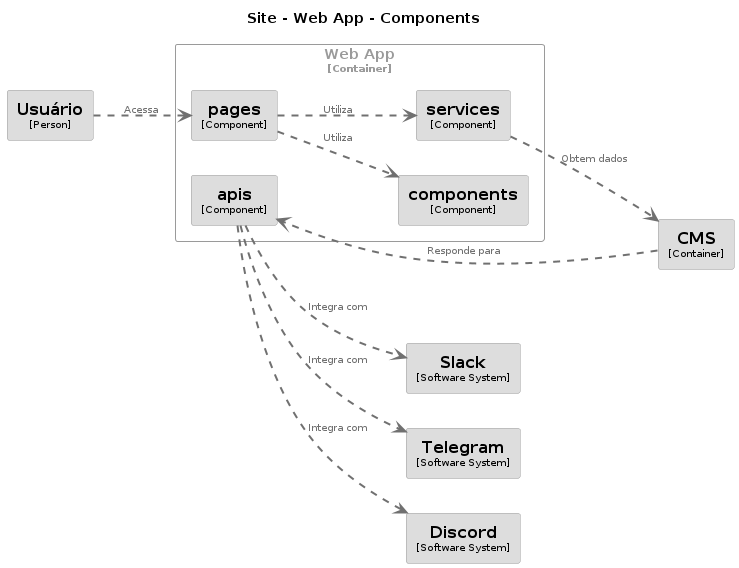

# Site da comunidade DEVPIRA

Esse é o código fonte do site da comunidade DEVPIRA. <br />
Assim como a comunidade, nosso site também é aberto ao compartilhamento e a construção colaborativa. <br />
Consulte a sessão de como Contribuir para envolver-se com o desenvolvimento. <br />
Você também pode se interessar no [Open Design do site da comunidade](<https://www.figma.com/file/31HWVqK1xgYQX85ej2TT67/Open-Design---Devpira-(Community)?type=design&node-id=0%3A1&mode=design&t=0xqqyOkb3ATqdFHT-1>)

## O Projeto


O site concentra informações sobre a comunidade, iniciativas, eventos, vagas...<br/>
A maior parte das funcionalidades se concentram no próprio site.<br />
Para alguns casos, fazemos integrações com outros canais da comunidade como ilustrado em "Aplicações externas".


O site é basicamente composto de um Web App.<br />
Os dados são providos dinamicamente para o CMS. Em alguns casos, o CMS dispara chamadas _webhook_ de volta para o site. Usamos esse mecanismo para fazer integrações.



O Web App é organizado em algumas partes:

- **pages**: onde se concentram as páginas que os usuários acessam;
- **components**: são os blocos de construção das páginas. São customizações sobre os componentes da biblioteca [MUI](https://mui.com) para se alinharem ao design proposto;
- **services**: são classes que fazem interface com o CMS e alimentam as páginas com dados;
- **apis**: para alguns cenários, como recebimento de formulários ou ouvir requisições _webhook_, fazemos uso de APIs.


Nossa aplicação é implantada no [Vercel](https://vercel.com) e usa [Contentful](https://www.contentful.com) como CMS.

## Contribuir

Nós escolhemos desenvolver o site em [NextJs](https://nextjs.org), um framework sobre [ReactJs](https://reactjs.org). Essa escolha vem do conhecimento do time inicial do projeto.<br />
Escolhemos o [Contentful](https://www.contentful.com) - um CMS - de _backend_ como forma de acelerar o desenvolvimento.

### Como baixar e executar

Para executar o projeto:

```sh
yarn
yarn dev
```

A aplicação estará acessível em [http://localhost:3000](http://localhost:3000).

### Antes de começar a codar

Usamos o [`ESLint`](https://eslint.org) para a manutenção dos padrões de código do ReactJS e NextJS.  
Para certificar-se de que seu código segue o mesmo estilo do restante do projeto, siga os passos abaixo (Para desenvolvimento via VS Code):

- Instale as extensões [`Prettier`](https://marketplace.visualstudio.com/items?itemName=esbenp.prettier-vscode) e [`ESLint`](https://marketplace.visualstudio.com/items?itemName=dbaeumer.vscode-eslint)

- Habilite a execução do [`husky`](https://typicode.github.io/husky/):

```sh
npx husky add .husky/pre-commit "yarn lint"
```

### Estratégia de _branching_

Escolhemos [`git-flow`](https://danielkummer.github.io/git-flow-cheatsheet/index.pt_BR.html) para nosso fluxo de desenvolvimento. <br />
Para novas funcionalidades, inicie uma `feature`; <br />
Para correções, inicie um `bugfix`;<br />
Ao finalizar o desenvolvimento, abra um _Pull Request_ para a _branch_ `develop`.<br />

### Submeter um _Pull Request_

Ao término do trabalho, abra um _Pull Request_ para `develop`. <br />
As implantações acontecerão quando o código for integrado à `main`, depois do fluxo de validação.

## Outas formas de contribuir

Consulte nosso [guia de contribuição](./CONTRIBUTING.md) =)

# Time _Core_

<table>
  <tr>
    <td>
      
    </td>
    <td>
      
    </td>
    <td>
      
    </td>
    <td>
      
    </td>
  <tr>
  <tr>
    <td>@abpaula77</td>
    <td>@fabiobaldins</td>
    <td>@lucastangi</td>
    <td>@murilobeltrame</td>
  </tr>
  <tr>
    <td>Dev</td>
    <td>Product</td>
    <td>UX</td>
    <td>Dev | Infra | Adm</td>
  </tr>
</table>

# Código de conduta

Consulte nosso [Código de Conduta](./CODE_OF_CONDUCT.md).

# Licença

O Site da comunidade DEVPIRA está licenciado pela [MIT License](https://github.com/dev-pira/site/blob/develop/LICENSE). Para mais informações, consulte nossa [Licença](./LICENSE).
